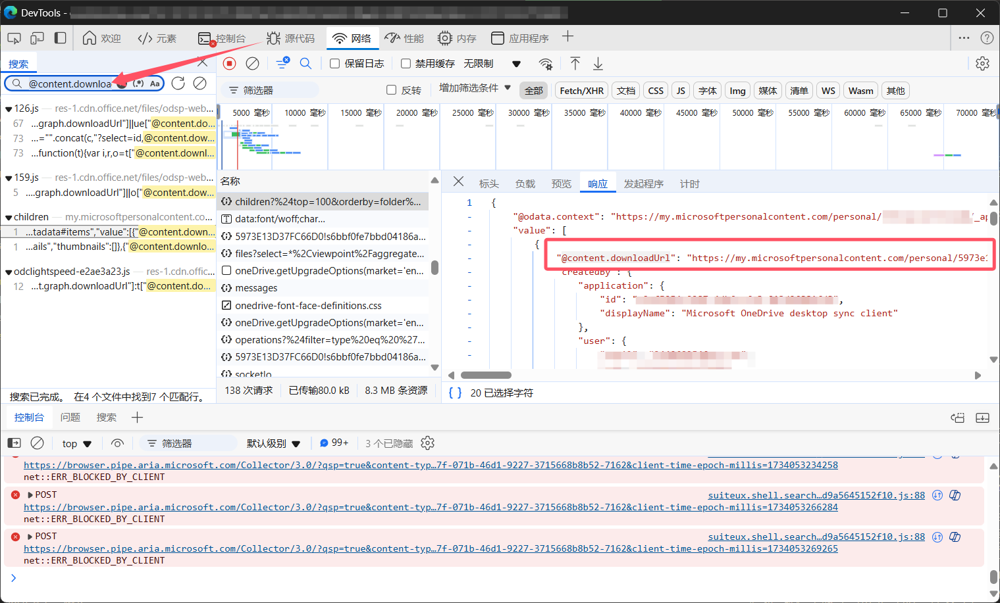

[简体中文](docs/Readme_zh-cn.md)

# OneDriveShareLinkPushAria2

Extract download URLs from OneDrive or SharePoint share links and push them to aria2, even on systems without a GUI (such as Linux).

从 OneDrive 或 SharePoint 共享链接提取下载 URL 并将其推送到 aria2，即使在无图形界面的系统中(如 Linux)依然可以使用。

# Dependent

requests==2.25.1

pyppeteer==0.2.5

# Feature

At present, this program supports the following download methods:

- xxx-my.sharepoint.com Download of share links
  - Downloading multiple files without password for shared links
  - Downloading multiple files with password for shared links
  - Download of files in nested folders
  - Download any file of your choice
  - Traversal view and download for multiple files (more than 30) of shared links
- xxx.sharepoint.com Downloads with share links
- xxx-my.sharepoint.cn Download of share links (theoretically supported)

**Note: aria2 itself does not support HTTP POST download links, while onedrive folder package download is HTTP POST download links, so this program will not support onedrive folder package download**

## Output file list

input this command then you can get file list in list.txt

```bash
python main.py > list.txt
```

It maybe output gibberish in powershell, you can input this command before to fix

```bash
[System.Console]::OutputEncoding = [System.Text.Encoding]::UTF8
```

## OneDrive Personal

As of December 13, 2024, OneDrive Personal download links are direct links. You can open F12 and refresh the page, then find the request `https://my.microsoftpersonalcontent.com/_api/v2.0/drives/{}/items/{}children?%24top=100&orderby=folder%2Cname&%24expand=thumbnails%2Ctags&select=*%2Cocr%2CwebDavUrl%2CsharepointIds%2CisRestricted%2CcommentSettings%2CspecialFolder%2CcontainingDrivePolicyScenarioViewpoint&ump=1` in the Network tab (the content in the curly braces will change with different files), and check the returned JSON data to find the `@content.downloadUrl` field, which is the download link.

Alternatively, go to the Network tab, press Ctrl + F, and enter `@content.downloadUrl` to find the corresponding request. Check the returned data to find the `@content.downloadUrl` field, which is the download link.


You can refer to the [test.py](test.py) file, which contains an example that can be run directly to obtain the corresponding JSON data.

## Without password for shared links

Take this download link as an example:

https://gitaccuacnz2-my.sharepoint.com/:f:/g/personal/mail_finderacg_com/EheQwACFhe9JuGUn4hlg9esBsKyk5jp9-Iz69kqzLLF5Xw?e=FG7SHh

At this time, you need to use the download code for no password link, that is, [main.py](main.py). Open this file and you can see that there are some global variables:

- OneDriveShareURL: The download address, which should be filled in here https://gitaccuacnz2-my.sharepoint.com/:f:/g/personal/mail_finderacg_com/EheQwACFhe9JuGUn4hlg9esBsKyk5jp9-Iz69kqzLLF5Xw?e=FG7SHh
- aria2Link: aria2's rpc address, usually `http://localhost:Port/jsonrpc` if it's native
- aria2Secret: the password of aria2
- isDownload: whether to download or not, if `False`, only the file list is output
- downloadNum: List of files to download, **0** means all of them

If you want to download the second file, you need `downloadNum="2"`

If you want to download the second and third file, you need `downloadNum="2-3"`

If you want to download the second, third, fourth, seventh file, you need `downloadNum="2-4,7"`

and so on.

After modifying, make sure the target aria2 is on and execute `python3 main.py`

## With password for shared links

Take this download link as an example:

https://jia666-my.sharepoint.com/:f:/g/personal/1025_xkx_me/EsqNMFlDoyZKt-RGcsI1F2EB6AiQMBIpQM4Ka247KkyOQw?e=oC1y7r

At this time, you need to use the download code for have password link, that is, [havepassword.py](havepassword.py). Open this file and you can see that there are some global variables (repeated without further ado):

- OneDriveSharePwd: Password for the OneDrive link

Usage is similar to the above.

# Note

Before you use it, clone the whole project with `git clone https://github.com/gaowanliang/OneDriveShareLinkPushAria2.git` to use it. havepassword.py depends on main.py, if you want to use the version that requires a password If you want to use a version that requires a password, you need to `pip install pyppeteer`

The basic functions of this program have been realized. For a long time, if the software is not unusable, it will not be maintained. If there is a running problem, please bring a download link when raising the issue. The bug type issue that does not provide a download link will not be solved.
